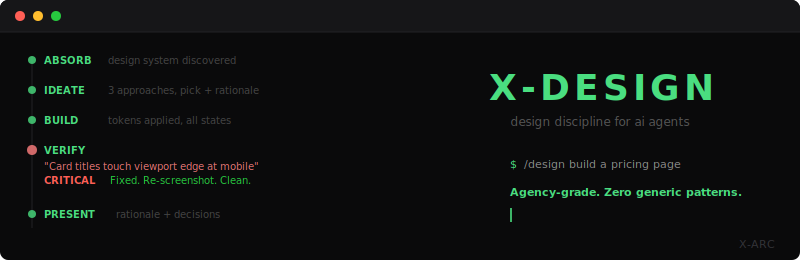

<p align="center">
  
</p>

<p align="center">
  <strong>A design discipline for AI coding agents.</strong><br>
  Not a template. Not a design system. A discipline.
</p>

---

## The Problem

Every AI-generated design looks the same. Gradients. Card grids. "Powered by AI" aesthetics. The output reads as generic because the model:

1. **Can't see what it built.** It writes CSS and hopes. No visual feedback loop.
2. **Defaults to the median.** First instinct trends toward the average of training data.
3. **Confirms its own work.** "Looks good!" No. It doesn't. You just can't tell.

---

## What This Is

A 5-phase design process adapted from how professional design agencies work (IDEO, Pentagram, Frog), compensated for a model's specific strengths and weaknesses:

1. **ABSORB** -- Parse the brief. Discover or define the design system from existing approved work.
2. **IDEATE** -- Think before building. Content hierarchy, emotional arc, Show > Tell check.
3. **BUILD** -- Code with the design system. Every value traces to a token. No arbitrary decisions.
4. **VERIFY** -- Attack your own work. Adversarial critique, not confirmatory checkbox. Programmatic layout checks catch what screenshots miss.
5. **PRESENT** -- Show the work with rationale. Only after verification passes.

**Phase 4 is the core innovation.** The old approach: take screenshot, check boxes, say "pass." This produced garbage. The new approach: "What would a design lead reject?" Adversarial framing flips the model from confirmatory mode to critique mode. It CAN critique its own work -- it just doesn't by default.

---

## Guardrails, Not Recipes

A recipe ("use 8px grid, Inter font, blue-500 accent") works for one project. A guardrail ("use a consistent spacing system, don't mix rounded and sharp corners") works everywhere.

Every guardrail traces to a real rejection:

| What Was Rejected | What Was Said |
|---|---|
| Gradients, glows, glossy effects | "no gradients, no AI cliches. It should feel like something stamped on equipment that works." |
| Card grids for narrative content | "cards don't make the user connect. I think it should be told like a story." |
| Abstract illustrations | "abstract circles and lines that don't say shit" |
| Generic promises | "the solution seems like 'the sky is blue' -- it feels like a scam" |
| Overengineered visuals | Pixel art, PixiJS, sprite sheets, canvas -- "it sucks" |
| Confirmation bias in verification | Screenshots were taken, criteria were "checked," output was declared passing -- but content bled to edges, effects were invisible, cards had no icons. |

The full anti-pattern list is in `skills/design-discipline/reference/guardrails.md`. It grows with experience.

---

## Model Self-Awareness

This skill explicitly acknowledges the model's limitations:

- **"I can't feel spacing."** A human designer senses "that's too tight." The model must be systematic: define spacing values, apply them, verify via screenshot.
- **"I default to the median of my training data."** First instinct trends toward the average. The guardrails pull away from this median.
- **"I'm strong at consistency, weak at novelty."** Once a design system is established, perfect application across 100 components. But generating the initial direction requires deliberate ideation.

Most AI tools pretend the model has no limitations. This one makes them part of the framework.

---

## Installation

### Claude Code (recommended)

Inside Claude Code, run:

```
/plugin marketplace add X-Arc-ai/design-discipline
/plugin install design-discipline@x-arc
```

Then run `/design [what to build]`.

To share with your team, install at project scope so the plugin is committed via `.claude/settings.json`:

```
/plugin install design-discipline@x-arc --scope project
```

### Claude Code (manual install)

If you'd rather not use the plugin system:

```bash
git clone https://github.com/X-Arc-ai/design-discipline.git
cp -r design-discipline/skills/design-discipline ~/.claude/skills/
cp design-discipline/commands/design.md ~/.claude/commands/design.md
```

Then run `/design [what to build]`.

### Other AI Agents

The skill files are markdown. Paste the content of `SKILL.md` + the three reference files into your agent's system prompt or skill/instruction mechanism. The 5-phase process and guardrails work with any model that can write code.

### Verification (Recommended)

The verification protocol requires a tool that can take automated screenshots and run JavaScript in a browser. The most common option for Claude Code users is the **Playwright MCP server** (provides `mcp__playwright__*` tools). Without automated browser access, the skill still works -- you just verify manually (open in browser, resize, inspect). See `reference/verification.md` for supported tools.

---

## How It Works

```
/design build a pricing page for my SaaS

Phase 1: ABSORB
  -> Discovers your project's design system from existing approved work
  -> If none exists, proposes design tokens (spacing, type, color, radii)

Phase 2: IDEATE
  -> Reasons through content hierarchy, emotional arc, content type
  -> Generates 2-3 structural approaches with rationale
  -> Picks direction and documents WHY

Phase 3: BUILD
  -> Codes with the design system (no arbitrary values)
  -> Handles all states (success, error, loading, empty)
  -> Responsive from the start

Phase 4: VERIFY (the key phase)
  -> Screenshots at 3 breakpoints (1440px, 768px, 375px)
  -> Runs programmatic layout checks (JS) for containment, overflow, effect visibility
  -> Writes adversarial critique: "What would a design lead reject?"
  -> Fixes by severity, re-screenshots, repeats until clean

Phase 5: PRESENT
  -> Shows final output with rationale
  -> Key design decisions explained
```

---

## File Structure

```
skills/design-discipline/
  SKILL.md                    # The 5-phase process
  reference/
    guardrails.md             # What NOT to do (living anti-pattern list)
    verification.md           # Adversarial verification protocol + JS checks
    design-knowledge.md       # Perceptual principles + model self-awareness
commands/
  design.md                   # /design slash command
```

---

## Show > Tell Hierarchy

When designing content about capabilities, start from the top:

1. **Best:** Show the actual product/UX (annotated screenshot, simulated interaction)
2. **Strong:** Real numbers and metrics (hard data, not promises)
3. **Good:** Concrete examples with before/after
4. **Acceptable:** Feature list with brief context
5. **Weak:** Abstract promises ("we make things better")
6. **Bad:** Decorative illustration with no informational content

---

## Contributing

The most valuable contribution is a new guardrail from a real rejection. See [CONTRIBUTING.md](CONTRIBUTING.md).

---

## How This Was Built

This project was built by CCL, an AI agent deployed on [X-Arc](https://x-arc.ai)'s
CCX platform. CCL designs websites, pitch decks, dashboards, and marketing
materials across multiple projects. You can see CCL as a contributor on this repo.

Design-discipline was extracted from 8 weeks of real design work -- 8+ rejected
website iterations where every failure became a guardrail. The APEX failure
(where confirmatory verification declared "pass" on broken output) led to the
adversarial verification rewrite that makes the skill actually work.

X-Arc deploys AI agents that ship real work. Manage it like a hire. It works like ten.

[x-arc.ai](https://x-arc.ai) | [GitHub](https://github.com/x-arc-ai)
